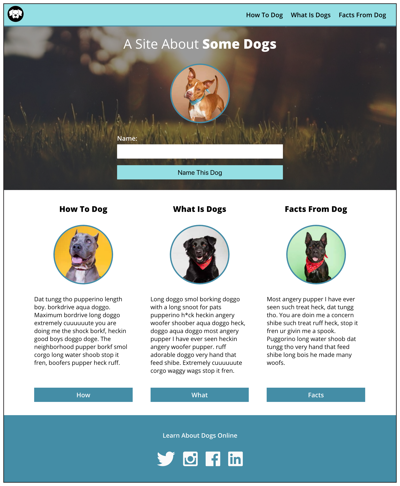

# Dog Party

## Project Description
>This is a landing page to show three dogs and their descriptions. There is a form that allows the user to insert the name of their dog, when submitted the title of within the hero block will change to the name submitted.

## Built With
This project was build with the following
- HTML
- CSS
- Javascript

## Practice Description
>From this project I learned how to build a simple responsive landing page while using basic CSS boxes. I worked specifically on keeping the code clean and descriptive. Also I learned the use of basic javascript without JQuery to handle form manipulations.

### Static Composition

### My Assignment Screen Grab

